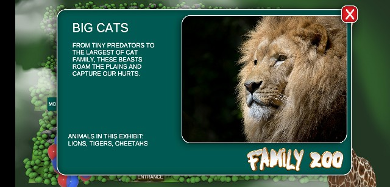

# Family Zoo
 Family Zoo is a simple app that shows an interactive map of a zoo and habitats within it

## Table of contents
* [General info](#general-info)
* [Screenshots](#screenshots)
* [Technologies](#technologies)
* [Status](#status)
* [Inspiration](#inspiration)
* [Contact](#contact)

## General info
Application has 6 habitats each habitat has a description and animals names within it, habitats names are:
  - AFRICA
  - BEAR DEN
  - BIG CATS
  - EAGLES NEST
  - GIANT BESTS
  - MONKEY HABITAT

## Screenshots

- #### Start Panel
  

- #### Map Panel
  

- #### Africa Habitat
  

- #### Bear Den Habitat
  

- #### Big Cats Habitat
  

- #### Eagles Nest Habitat
  

- #### Giant Beasts Habitat
  

- #### Monkey Habitat
  

## Technologies
* Unity - 2018.3

## Status
Project is: for development purpose

## Inspiration
Project inspired by [The Ultimate Guide to Real World Applications with Unity](https://www.udemy.com/the-ultimate-guide-to-real-world-applications-with-unity/) udemy course

## Contact
Created by [Mohamed Abdelnaby Elattar](https://www.linkedin.com/in/maaelattar) - feel free to contact me!
